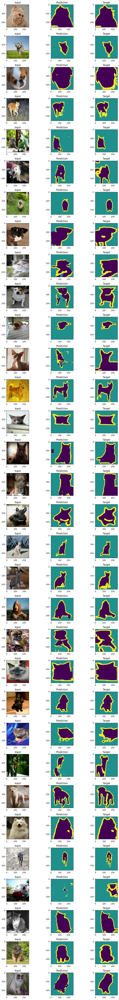

**Test results**

**Project Descriptions**

In this project, I'll be doing some cool image stuff called deep learning-based segmentation. Basically, it's all about using fancy neural networks (CNNs) to chop up images into different parts, and it's pretty awesome because it can understand all the tiny details and give us better results. One cool architecture I'll be using is called U-Net, which has this cool way of capturing the big picture and then zooming in for more precision. To make things even more exciting, I'll be working with the Oxford-IIIT Pet dataset, which has tons of adorable cat and dog pictures along with super accurate annotations. For the technical side, I'll start with the VGG16 model, which is like a superhero in computer vision, and then tweak it to include the U-Net magic. It's going to be a fun and powerful way to segment those cute pet images!